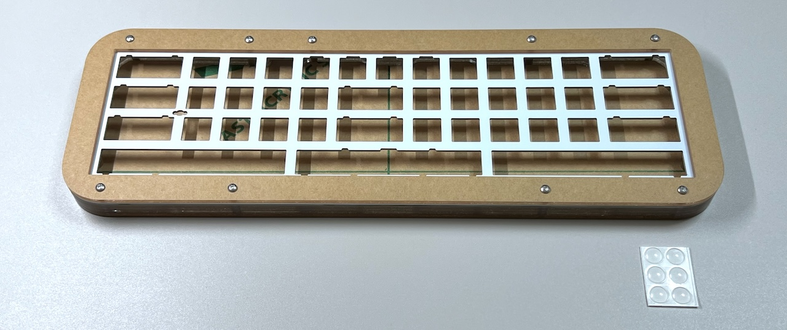

# On the 15 アクリル積層ケース

## キット内容

||||
|-|-|-|
|トッププレート|1|アクリル|
|スイッチプレート|1|FR4|
|ミドルプレート|3|アクリル|
|ボトムプレート|1|アクリル|
|ねじ|18|6mm|
|スペーサー|9|8mm|
|ゴム足|6||

## キット以外に必要なもの

|||
|-|-|
|[On the 15](https://shop.yushakobo.jp/products/4994)|1|
|キースイッチ|〜60|
|キーキャップ|〜60|
|Type-C USBケーブル|1|
|（オプション）スタビライザー|1|
|（オプション）ロータリーエンコーダーとノブ 〜4|1|

## 組み立て方
> [!NOTE]  
> On the 15のPCBの組み立て方はOn the 15のビルドガイドをご覧ください  
> - https://github.com/Taro-Hayashi/On-the-15/blob/main/README.md

組み立てられた状態のケースを一度分解します。  
  
ケースに付属のスイッチプレートを挟み込むように、On the 15のメインボードにキースイッチを差し込みます。  
  
  
トッププレートをスイッチプレートにのせ、裏返してねじとスペーサーで止めます。  
  
  
  
ミドルプレートを3枚乗せます。  
  
   
ボトムプレートをねじで止め、ゴム足を貼ります。  
  
  
表でねじを少し締め直し、キーキャップを付けたら完成です。  
  
  

## その他
アクリルプレートとスイッチプレートのデータは公開予定です。  
